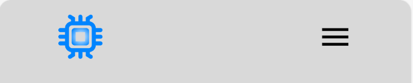
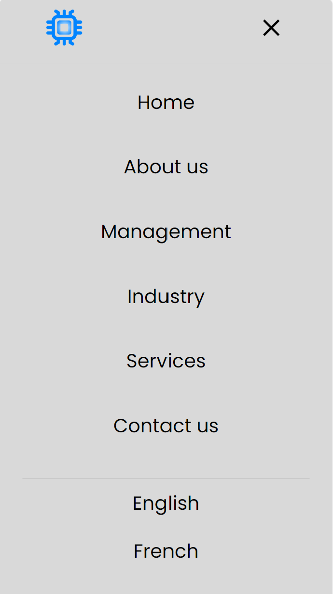

# **RS Vision Consulting Ltd**
<!-- add pictures of screen preview -->
<!-- add a company review why I built it and what does it do -->
## Table of Contents
1. [User Experience](#user-experience)
    - [Goals](#goals)
    - [Business Goals](#business-goals)
    - [User Stories](#user-stories)
2. [Design](#design)
    - [Colour Scheme](#colour-scheme)
    - [Typography](#typography)
    - [Imagery](#imagery)
    - [Wireframes](#wireframes)
    - [Programs Used](#programs-used)
    - [Photo and Video](#photo-and-video)
    - [Icons](#icons)
3. [Features](#features)
    - [General Features](#general-features)
    - [All pages](#all-pages)
    - [Nav bar](#nav-bar)
    - [Footer](#footer)
    - [Banner](#index-page)
    - [Index Page](#index-page)
    - [About us](#about-us)
    - [Management](#management)
    - [Services](#services)
    - [Industry Sectors](#industry-sectors)
    - [Contact Page](#contact-page)
    - [Cookie Policy](#cookie-policy)
    - [Privacy Policy](#privacy-policy)
    - [Terms and Conditions](#terms-and-conditions)
    - [Modern Day Slavery](#modern-day-slavery)
4. [Future Implementations](#future-implementations)
    - [User Usage Future Implementations](#user-usage-future-implementions)
    - [Contact Us](#contact-us)
    - [Audio](#audio)
    - [Industry Page Flexboxes](#industry-page-flexboxes)
    - [Language](#language)
    - [Search Section](#search-section)
    - [Cookies](#cookies)
    - [Additional Pages](#additonal-pages)
    - [Audio](#audio)
    - [Logo](#logo)
    - [Accessibility](#accessibility)
4. [Technologies used](#technologies-used)
    - [Languages](#languages)
    - [Libraries](#libraries)
    - [Platforms](#platforms)
    - [Other Tools](#other-tools)
5. [Local Development & Deployment](#local-development--deployment)
    - [Local Development](#local-development)
        - [Local Preparation](#local-preparation)
        - [Local Instruction](#local-instruction)
    - [Github Deployment](#github-deployment)
        - [Github Preparation](#github-preparation)
        - [Github Instrucation](#github-instruction)
6. [Testing](#testing)
    - [Methods](#methods)
    - [Validation](#validation)
    - [General Testing](#general-testing)
    - [Mobile Testing](#mobile-testing)
    - [Desktop Testing](#desktop-testing)
7. [Bugs](#bugs)
    - [known bugs](#known-bugs)
    - [Fixed bugs](#fixed-bugs)
 
7. [Credits](#credits)
    - [Acknowledgement](#acknowledgement)
8. [Contact](#contact)

# Project 2 - Important Notes
I made the decision to implement Project 2 (JavaScript) on top of my Project 1 website. The reason for this is the website was developed for my partners business so is going to be a live published website from March 2024. The use of JavaScript is essential for feedback forms to function, supporting validation rules and re-directing completed forms to the 'Thank you for your enquiry' page. Further the submit button also changes colour to indicate the form is complete having met the validation criteria so is now ready to be submitted. My partner intends to conduct business in France, so the French language option was implemented. The FAQ's section was added on the 'About Us' page to provide interactivity around some of the key questions and considerations clients should factor in when selecting a video telematics partner demonstrating industry expertise. Cookie acceptance pop-ups are also a requirement to comply with Cookie rules, before the website was able to be published. This also utilises JavaScript. Some useful industry data was added to the industry page using an interactive chart which allows uses to select specific year/s of interest displaying the relevant data/results within the interactive chart. A slider displaying key messages regarding his company was also added to the Index/home page of the website. We also added a button which takes the user back to the top of the page which also uses JavaScript. In summary I felt this was a good and practical application of JavaScript which i believe meets the required course criteria in real-world application hence my decision to implement Project 2 over my Project 1 website.

# User experience
## Goals
### Visitor Goals
- Visitor Goals
The target audience for RS Vision Consulting are:

- People who want more information on consulting.
- People who have an interest in Video telematics, Telematics, Automotive and OEM.
- Businesses who want to grow and expand their business.
- Businesses who are needing help to meet their sales targets.
- Businesses who are trying to expand the business, grow their business and create new departments.

User goals are:

- View information easily.
- Get highlighted points of information.
- Contact the Consultants easy with different options of contact.
- Get deeper info if required.
- Bullet point section on services with been bombarded with text to find the information.

RS Vision Consulting fills these needs by:

- Starting with a eye catching video and then image to draw people in.
- Having the flex boxes on the main page is to draw people in to reviewing the services and industry sectors and contact us.
- Having access to all the pages in the Nav makes to easier for the user to navigate through the site.
- Have all the additional information like Cookies, Terms and Conditions, Privacy Policy and Modern-day slavery helps the user understand in more detail the company policies and ethics, where we stand and future proofing the site for them.
- Proving flex boxes in the industry section helps the user high light the specific area they are in.
- Having videos and images throughout the site helps the user understand the industry we are in and create nice eye-catching images for them to review.
- Have different ways to contact us on the contact page, gives the user options that is easier for them.

### Business Goals

The Business Goals of RS Vision Consulting are:

- Display and highlight what we are about.
- Get an understanding about what services we do.
- Get an understanding about what sectors we specialise in.
- Get businesses to contact us to get more information.
- Gain more customers.

### User Stories

<div align="center"> 
    
</div> 

<!-- add your stories - how your user will feel about the site -->
- As a company I would like to see what relevant experience the consultancy company has in my area of business.
- I would like to see what Sectors the consultancy company specialise in.
- As a customer looking at optimising my business's profitability and Growth i would like to see what services they offer throughout my business.
- While visiting a consultancy website, I want to Navigate through their services and Industry sectors seamlessly and have a direct link to contacting them on every page.    
- I want to be able to contact the consultancy company with direct open-ended questions.
- I would want an understanding of the company background and experience in all areas. 
- I want to be able to review the site and get the detail I need easily without reading huge amount of text.
- Where I want to, I want to be able to get more detail on the specific areas I am interested.
- As a company I want to be able to the site wherever I am in on any form device and get an easy fluent way to navigate, find the information easy and have high-lighted points as my time is sparse.
- I would like clear calls for action on the basis their services are of interest to my business

# Design
## Colour Scheme
<div align="center"> 
    
</div> 

- #000000 was used in all the font text
- #0000FF was used for highlighting the font in the hover in the header and footer
- #83C2FB was used as a backing to the image on the About us page
- #FFFFFF was the main background on all ages
- #D9D9D9 was used in the boarder, header and footer

## Typography

<div align="center"> 
    
</div> 

- My primary font is [Poppins](https://fonts.google.com/specimen/Poppins?query=poppins) which is on all pages of the website
- I used Poppins font as it is clear for everyone to read, whilst also having a great style look for a Consultancy / technology business.

## Imagery
<div align="center"> 
    
</div> 

- These are the photos I purchased from istockphoto.com
- I researched hundreds of photos to get the best image to represent the relevant area of my business.
- They matched in line with the Businesses and the sectors we are working in.
- Project 2 - The image of Richard Lane taken for the Management Page was a photo he took of himself for this site.

## Wireframes
- [Link to Wireframes](https://www.figma.com/file/OR9ALOmeSW29mY6VmIh4jx/Webpage-frontcover?type=design&node-id=0%3A1&mode=design&t=VkHTziaTuZjlnrDv-1)
    - This is the initial design I created. I was going to implement a Management page in this project, but as i wanted it to sit in the About us section as an accordance which I know is a JavaScript element, so I decided to wait for project 2 to implement.  
    - I tried numerous fonts and design lay out inside Figma until I found the look and design I liked.

## Programs Used
- [Link to simple imager resizer](https://www.simpleimageresizer.com/)

- [Link to tiny png](https://tinypng.com/)

- [Link to free convert](https://www.freeconvert.com/)
    - These are the programs I used to resize and convert the image to increase the performance of the site for mobile and desktop usage.

 ## Photo and Video
 - [Link to istock photo](https://www.istockphoto.com/)
    - I purchased the images from this site, I downloaded numerous preview images and placed them into my site until I found the best pictures and videos to convey the subject matter message.
## Icons
 - [Link to icons8](https://icons8.com/)
        - This is where I downloaded my Favicon Icon
        - This is also where I got my logos in my flexboxes on my main page.  

# Features
## General features
### All pages
## Nav Bar
<div align="center"> 
    
</div> 

- This Nav bar is on all 5 pages with the minimal design. 
- This Nav bar is fixed in place, so when you scroll down you can still access all pages.
- If you click on the logo, it will take you back to the home page. 
- Project 2 - There is now 6 pages, as there was a management page added for the user to get more detail of the people and there experience. 
- Project 2 - The logo has also been re-deigned for greater brand awareness 

<div align="center"> 
    
</div> 

- This is the look of the nav bar in the format of a phone
- I wanted it to look sleeker and user friendly in the style.
- Anything below 768px will show this format by using media queries. 

<div align="center"> 
    
</div> 

- This is the look of the Hamburger Nav.
- When you click on the 3 links it brings the Nav list up.
- If you click on the logo, it will take you back to the home page.

## Footer
<div align="center"> 
    
</div> 

- This footer is also accessible on all pages.
- The footer also holds the Terms and Conditions, Privacy policy, Cookies Policy and Modern-Day Slavery Policy.
- The is aligned into the middle of the screen and has a blue Hoover to highlight and access the links to the external documents.
-  Project 2 - Facebook, Twitter and Linkedln social media links have been added 

<div align="center"> 
    
</div> 

- This is what the phone looks like in the phone format.
- Anything below 768px will show this format using media queries.

**Banner**
<div align="center"> 
    
</div> 

- This Banner is on all pages except the main page
- The Banner is on every page for continuity throughout the website and to highlight we specialise in Technology including API's. 

## Index page
<div align="center"> 
    
</div> 

- This is my main page video, I wanted to make it eye catching, stylish, easy to read, easy to navigate, while also been user friendly.
- I also wanted this to be on point regarding conveying high-level the services we provide in the industry sectors we support.
- With hours of research I thought video was the best way to convey the technology / Ai side of the business.

<div align="center"> 
    
</div> 

- I added this image to make the front page be attractive to the eye, whilst also been industry specific.
- Knowing that this image is eye catching, I wanted to add text to it to draw people in.
- Knowing the image will draw the user eye, and adding some basic text I created a contact us href to draw them to the contact us page.

<div align="center"> 
    
</div> 

- Project 2 - I created a slider to create more end user functionality.
- The slider also give the end user highlighted points from each page. 
- It gives the end user another direct link into the Industry sector page.

<div align="center"> 
    
</div> 

- I created the flex boxes to make it easy for the user to navigate from page to page, whilst also future proofing the site for changes.
- I also created the design to make it more adaptable from different devices.
- I didn't want there to much content on the Index page to entice users to click through the site to read more content.
- Making the boxes enlarged when you hover over them was for design but also practicality as its enlargers the words.
- I used the Icons instead of photos to on the flexboxes to help with the performance of the site.
- The Icons was used to make each box easier to determine where the link is taking you. 

## About us
<div align="center"> 
    
</div> 

- I wanted to make the about us easy to look at as there is more content to review.
- The image was added for design and industry/page specific. 
- I had broken down the text to make it easier to read and can speed read over certain areas the user is interested in.

- An FAQ (Frequently Asked Questions) section was added to the About us page to provide further user interactivity on the website. 
- This also provides answers to some of the key questions relating to video telematics technology to demonstrate expertise to potential consultancy clients. 
- The questions focus in on some of the key points where customers may have experienced challenges and if not highlights some of the areas which should be carefully considered.

## Management
<div align="center"> 
    
</div> 

- Project 2 - The reason this was created was to give confidence to the end user. 
- 1) Provide confidence in the management teams ability to provide consultancy services.
- 2) Extend upon the information on the About Us page to provide more specific information on the management team.
- 3) Provide information on the background of CEO including his skills and experience.
- 4) Provision of information on other senior team members.

## Services
<div align="center"> 
    
</div> 

- Service page is an important page for the user to understand what we offer.
- I created bullet points to high light the area we cover
- Then went into more details on specific areas for the user to get a deeper understanding.
- I created the background block behind the image to make the image stand out more and make more of an impact.

## Industry Sectors
<div align="center"> 
    
</div> 
<div align="center"> 
    
</div> 

- I created the content in the flex boxes for future implementations.
- I also created the information in the flex boxes so it highlights the specific area for them to review.
- I created the page this way so it was easy to transition on devices.
- I kept the wording in high level without bombarding the user so they take it in and make them contact us for more information. 
- I decided not to use images on this page as I didn't want to take away from the content and the design itself still made the style look nice.
- Project 2 - I created an interactave google chart to show historical and predicted future growth.
- Project 2 - The google chart allows users to select the metrics of interest and select data from one or multiple years.  

## Contact page
<div align="center"> 
    
</div> 

- I created a contact us form where the user could pick a specific area there want more information on and a text area where they can go into more details.
- They cannot submit the form unless all areas are filled in.
- I added RS Vision Consulting information for them to contact us through email if they require and they can also research into the business if they require to do so.
- Project 2 - Once all the areas of the contact us form has been filled in the submit button will highlight blue to notify the end user the form is ready to submit.
- Project 2 - Once the form is submitted the end user will recevie a pop up that says thank you for contacting RS Vision Consulting and we will be in contact with you in 48 hours. 

## Cookie Policy
<div align="center"> 
    
</div> 
 - I designed a cookie policy for the users, which is for now but also to future proof the sight.
 - When JavaScript is added to this website, they will also be a popup that the users must accepted or decline when entering the website.

## Privacy Policy
<div align="center"> 
    
</div> 
- Privacy policy was added for the users to understand how the RS Vision Consulting works from a Privacy point of view. 

## Terms and Conditions
<div align="center"> 
    
</div> 
 
 - Terms and Conditions are there for the user to get a deeper understanding on how RS Vision Consulting defines the Terms and Conditions.

## Modern Day Slavery
<div align="center"> 
    
</div> 

- This is for the user to know we do obey with the Modern-Day Slavery act, so they know that is important for us. People come first.

## Future Implementations

### User Usage Future Implementations

-  In the future existing customer will be able to log in their own portal/account through the website home page or the specific industry section on the industry page.
- The existing customer will be able to review.
    - Invoices.
    - Payment link to pay the invoice.
    - Contracts.
    - Project timeframes.
    - Project information, like any work that has been completed and deadlines of things that are not complete.
    - If they have requested for a platform to be designed, they will also be able to see design, any updates, any notes the developers have added and create any notes themselves.
    - On the contact us page, once the form is complete the submit button will highlight blue to show complication and ready to submit, once I have learnt JavaScript. 

### Contact Us

- Once I have learnt JavaScript I will be making the submit button talk directly to my email, so I will receive all notifications from user my email. 
- Project 2 - The submit button talking directly to my email, so I will receive all notifications has been complete. 
- Project 2 - I would like to expand on this by adding a automated Bot, that can answer questions directly.

### Audio 

- I will be creating Audio on all sections to help improve further accessibility for visual impaired and people with learning difficulties.
- Project 2 - I would like to add the Audio in different Languages in my future developement. 

### Industry Page Flexboxes

- The reason why I did it all in sections in the industry page as flex boxes was so i could us this page as an industry section overview and each on the individual section inside once click on will create a new page on that specific sector. This will then go into more detail.
- Once we have more customers, we will also add in their customer reviews, which be industry specific.
- The next step would be each one of them will work as its on individual app on a phone, so existing customer can click on their specific area, and it will create a login option so they can log into their account.

### Language

 - In the Nav bar (on every above 768px) the Contact us link that is in the right-hand corner will move over and be centralised and there will be a language change option. So, customer around the world will be able to read the Content in their language. As seen in my Figma design.
 - Project 2 - The language option of French has been added but i would like to implement more Lanuage options 

### Search Section
 - In the Nav bar (on every above 768px) the Contact us link that is in the right-hand corner will move into the middle and next to the language section will be a magnifying glass for the search section. As seen in my Figma design.
 - The user will be able to search any key words on the site and will take them to the relevant information they require.

### Cookies

- Once I have learnt JavaScript I will adding a pop-up Cookie section once you are in the page. That the customer will have to accept or decline.
- Project 2 - I have created a cookie pop up once you have logged in, which will give the end user an option to Accept, Decline or xxxxxx where they will get the information from the cookie policy. 
- Project 2 - xxxxxxxxxxx

### Additional pages

- Management Page, I have already designed the management page on my Figma. This will added underneath the about us section in the Nav once I have learned JavaScript.
- Additional pages on industry Section, for more information on the indutry sector section on future implementations.
- Project 2 - The management page has been completed and added into the Nav bar for easy navigation.

### Audio

- In future my audio control bar will be a single speaker button, so that the user can click to play and pause, that will be implemented through JavaScript. This will improve the look and style of the pages.
- Project 2 - The Audio future implementations for the speaker button has been completed. 

### Logo

- A new logo will be designed in the future to improve style/look and brand awareness.
- Project 2 - I  have designed a new logo to help with brand awareness. This will show on page in the header. It will also act as a home buttom to navigate back to the home page.

## Accessibility
**Audio**

- I created Audio script on the main sections of the website for Visually impaired people and people with learning difficulties. After doing some research and talking to people who was affected by been visually impairment and a Managing Director of a blind charity for children, they commented saying it was forward thinking and really positive approach to be inclusive of all individuals. They mentioned they wish all websites would adopt a similar approach. 
- As my website expanded, I will increase the amount of Audio where required. 
- I also created the NAV Bar to be fixed on all pages, so it is easy to access all elements no matter what page you are on.
- Project 2 - I have created a speaker button instead of a control bar to improve style and look within the site.
- Project 2 - I added Audio to the Management page to keep inline with the use ability of the site.


# Technologies used
## Languages
- [HTML](https://developer.mozilla.org/en-US/docs/Web/HTML)
    - Page markup
- [CSS](https://developer.mozilla.org/en-US/docs/Learn/CSS)
    - Styling
## Libraries 
- [Google Fonts](https://fonts.google.com/)
    - Font style 
## Platforms
- [Github](github.com)
    - Store the code remotely for deployment
- [Gitpod](gitpod.io)
    - Development environment for the project
## Other Tools
- [Figma](figma.com)
    - Wireframe design
# Local Development & Deployment

## Local Development

### Local Preparation
**Requirements**
- IDE like [Visual Studio Code](https://code.visualstudio.com/download)
- [Git](https://git-scm.com/)
- [Python](https://www.python.org/downloads/)

### Local Instruction
1. Clone the repository and go inside the folder
```
git clone https://github.com/samanthamoss87/Project-1.git
```
2. Open your IDE and open the folder you just cloned
3. Open terminal on the IDE and run this command to run the project
```
python3 -m http.server
```
4. Enjoy the site

## Github Deployment
### Github Preparation
- Create a free Github account 

### Github Instruction
1. Login into your Github account 
2. Setup your repository
3. `git add .`, `git commit -m "your commit message"` and `git push` to the repository
4. Go to the **Setting** page of the repository 
5. Scroll down to the **Github Pages** section
6. Select the Master branch as the source and **Confirm** the selection 
7. Wait a few minutes and check the URL you are having on the page 


# Testing

## Methods
### Validation 
- HTML has been validated with https://validator.w3.org/#validate_by_input
- CSS has been validated with https://jigsaw.w3.org/ and auto-prefixed with https://autoprefixer.github.io/.
- Links checked with https://validator.w3.org/checklink.
- I also used https://pagespeed.web.dev/

### General Testing 
- Each feature was testing when it implemented into the code on both safari and chrome.
- The site was sent to family and friend to review and get their feedback.
- Contact us form have validation and will not submit without all information filled in.
- The videos and images were testing on all devices and browsers for performance/load speed. 

### Mobile Testing
 - I tested the site on IOS and Android device using my phone and family members phone, going through the entire process, checking button, functions, load speed, style etc.         
- Chrome and Microsoft edge was used to inspect the site in mobile format, looking at functions, responsiveness and style.

### Desktop Testing 
- The website was designed on Microsoft laptop, and it was previewed in Chrome and Microsoft edge. 
- The website was tested by family and friends and numerous different devices.

# Bugs
## Known bugs
- The logo was not navigating to the index page.
- The images were lowering the performance.
- The text was sitting outside the box on small screen iPhone.
- The wording inside the video on the index page was not aligned vertically.
- The personal statement box was too big with the fixed height.
- The text was overlapping on the button on the get in touch section in the index page.


## Fixed bugs
- By putting the logo in anchor tag it is fixed.
- I placed the website in simpleimagerezer.com, Tinypng and Freeconvert to improve the performance.
- To fix the text falling outside the flex boxes on the index page in the small screen iPhone I had to remove the fixed height.
- The reline the wording in the Video on the index page I removed the translate Y.
- By removing the fixed height, it is now properly sized.
- Reducing the text size and width of the text it is fixed.


# Credits

## Acknowledgement
- My joint business partner of RS Vision Consultancy Richard Lane helped with writing some of the content for our site.   

# Contact
- Please feel free to contact me at samantha.moss87@aol.com
